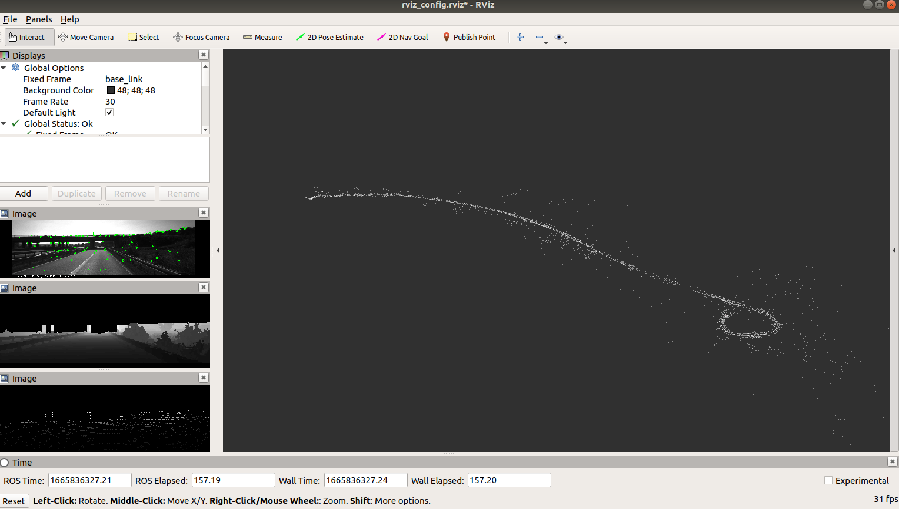

# ORB-SLAM2 with Depth Completion
**Developer**: Wenyu Li, Zijun Wang

**Email:** uestc_wenyu@foxmail.com

We modified the kitti publisher code from [A LOAM](https://github.com/HKUST-Aerial-Robotics/A-LOAM). Then a python depth completion algorithm, [IP Basic](https://github.com/kujason/ip_basic), is integrated in real time with a SLAM application, [ORB SLAM2](https://github.com/appliedAI-Initiative/orb_slam_2_ros). 

A depth completion module helps visual SLAM work with RGB-D mode in outdoor scenes. It detects a longer and more accurate distance compared with stereo or RGB-D cameras.

This is part of my master thesis research [SLAMMOT](https://github.com/WenyuLWY/SLAMMOT). But this repository is just an engineering incremental work, so feel free to use it.


# 1. Prerequisites

### 1.1 Ubuntu and ROS

Having test it on Ubuntu 18.04 and ROS Melodic.

### 1.2 Libraries

Please install **Eigen3**,**Opencv**,**PCL**. 

Default version provided in ROS in enough.

```
sudo apt install libeigen-dev
sudo apt install libopencv-dev
sudo apt install libpcl-dev
```


### 1.3 Dataset

We use kitti odometry dataset for testing. If you want to use another dataset, you need to extract the depth completion code in C++ and integrate into your own program.

For kitti odometry dataset, download and unzip them.

Organize the kitti odometry data set like:
```
├── dataset
│   ├── poses
│   │   ├── 00.txt
│   │   ├── 01.txt
│   │   ├── xx.txt
│   └── sequences
│       ├── 00
│       │   ├── calib.txt
│       │   ├── image_2
│       │   ├── image_3
│       │   ├── times.txt
│       │   └── velodyne
│       ├── 01
│       │   ├── calib.txt
│       │   ├── image_2
│       │   ├── image_3
│       │   ├── times.txt
│       │   └── velodyne
│       ├── xx
```


open and edit line 3-5 in : *orb_slam2_ros/ros/launch/orb_slam2_kitti_image_lidar.launch*

folder refers to the dataset folder.

save path refers to the trajectory save path when it is finished.


open and edit line 207 in : *slammot/src/kittiHelper.cpp*

`PyRun_SimpleString("sys.path.append('/home/wenyu/catkin_ws/src/slammot/src')");` 

change the following path where the  *depth_map_utils.py* file actually is.

I guess there is an elegant way for using python script in C++ program, but I haven't got an idea.


# 2. Build


## ORB SLAM2 ROS
Please follow the [ORB SLAM2 ROS](https://github.com/appliedAI-Initiative/orb_slam_2_ros) repositiory. 

 [ORB SLAM2 ROS](https://github.com/appliedAI-Initiative/orb_slam_2_ros) requires to install other ROS packages by rosdep.

```
sudo rosdep init
rosdep update
rosdep install --from-paths src --ignore-src -r -y
```
If you failed or get an error when update rosdep, you might install fishros and use *[rosdepc](https://fishros.com/#/fish_home)* instead of *rosdep*.


## Build and Run
It is build on [catkin tools](https://catkin-tools.readthedocs.io/en/latest/installing.html), install catkin tools and run:
```
sudo apt install python-catkin-tools
```

If you build ros workspace using catkin_make, you may get errors. Just remove folder *build* and *devel* in your current workspace. Then run the following code:

```
catkin init
catkin build
```

And start these ros nodes by a launch file:

`roslaunch orb_slam2_ros orb_slam2_kitti_image_lidar.launch` 

you can see results in rviz like this:



